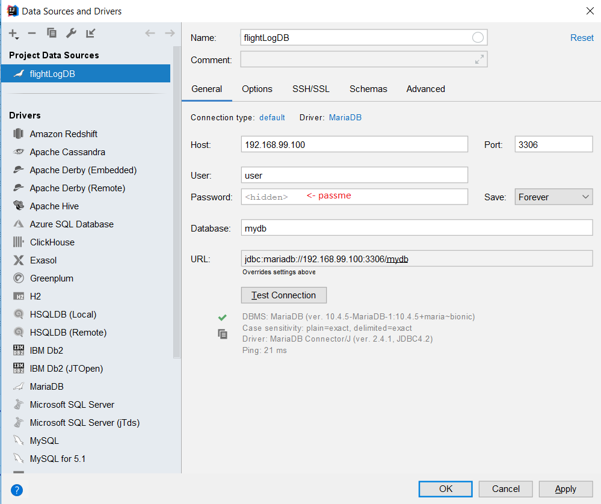

# flightLog
## Repository of our SYP-Project flightLog

http://vm81.htl-leonding.ac.at:8080/issues/flog

### Starten des Programms

#### 1. Projekt in IntelliJ geöffnent  
In IntellJ: File -> Open -> [Verzeichnis von Project]/flightLogFXML

#### 2. Datenbank Starten  
In Terminal zu /flightLog navigieren -> docker-compose up -d

#### 3. Datenbank in IntelliJ hinzufügen  
Am rechten Rand von IntelliJ auf Database klicken, dann auf + -> Data Source -> MariaDB
  

Wenn nötig, Treiber installieren (Links neben OK Button)  

Danach kann man das Projekt wie gewohnt starten

### Guide

Wenn man nicht angemeldet ist, kann man siche jegliche Daten anzeigen lassen, um sie jedoch zu erweitern, muss sich der User anmelden.
Anmelden kann man sich über das Login Fenster mit Usernamen 'peda', 'hans' oder 'franz' und keinem Passwort.
Nun kann man Flüge und Drohnen hinzufügen.

### ToDo
Login mit ldap (Es felht eine Connextion-URL des Ldap Servers)

### Used Technologies and Libraries
* [Java SE](https://www.w3schools.com/java/)
* [Java FXML](https://javabeginners.de/Frameworks/JavaFX/FXML.php)
* [JDBC](https://www.tutorialspoint.com/jdbc/)
* [Docker](https://www.docker.com/)
* [mariaDB](https://mariadb.org/)
